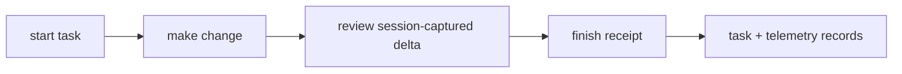

# Walkthrough

This is a developer verification walkthrough for the Forge receipt loop in a
temporary environment. Normal users should start with the one-command install
in [INSTALL.md](../INSTALL.md). For the concepts behind these steps, see
[Why Forge](WHY_FORGE.md), [Architecture](ARCHITECTURE.md), and
[Lifecycle](LIFECYCLE.md). For the product artifact these steps produce, see
[Receipts](RECEIPTS.md).

The flow exercised here is:



Build and install into a temporary environment:

```bash
cd ~/forge
python3.12 -m build
tmp=$(mktemp -d)
python3.12 -m venv "$tmp/venv"
"$tmp/venv/bin/pip" install dist/forge-0.1.0a1-py3-none-any.whl
export HOME="$tmp/home"
mkdir -p "$HOME" "$tmp/repo"
git -C "$tmp/repo" init -q
git -C "$tmp/repo" config user.email walkthrough@example.invalid
git -C "$tmp/repo" config user.name Walkthrough
printf 'base\n' > "$tmp/repo/base.txt"
git -C "$tmp/repo" add base.txt
git -C "$tmp/repo" commit -q -m baseline
```

The MCP command is `$tmp/venv/bin/forge`. Point one MCP stdio configuration at
that command. The packaged OpenCode plugin entry is under the environment's
`site-packages/forge/plugin/opencode/dist/index.js`; register that file once.
The TypeScript plugin applies host-tool policy in-process.

Run a complete lifecycle with an explicitly redirected runtime root:

```bash
"$tmp/venv/bin/python" - "$tmp" <<'PY'
import json
from pathlib import Path
import sys
from forge.service import ForgeService

root = Path(sys.argv[1])
repo = root / "repo"
runtime = root / "home" / ".forge"
service = ForgeService(runtime_root=runtime)
started = service.start_task("add feature", str(repo), ["feature.py"], "walkthrough-session")
(repo / "feature.py").write_text("answer = 42\n", encoding="utf-8")
reviewed = service.review_changes(started["task_id"], [{"status": "passed", "command": "python -m compileall"}])
finished = service.finish_task(started["task_id"], True, "Added feature", [{"status": "passed"}])
assert reviewed["state"] == "reviewed"
assert finished["state"] == "completed"
print(json.dumps(finished, indent=2))
print((runtime / "tasks.jsonl").read_text())
print((runtime / "telemetry.jsonl").read_text())
PY
```

Demonstrate fallback separately; it remains unverified and lifecycle-incomplete:

```bash
"$tmp/venv/bin/python" - "$tmp" <<'PY'
from pathlib import Path
import sys
from forge.service import ForgeService

root = Path(sys.argv[1])
service = ForgeService(root / "home" / ".forge")
result = service.submit_outcome(False, "Backend unavailable", "adapter outage", repo_root=str(root / "repo"))
assert result["state"] == "degraded"
assert result["verified"] is False  # deprecated alias; use lifecycle_verified instead
assert result["lifecycle_verified"] is False
assert result["lifecycle_complete"] is False
assert result["verification_basis"] == "degraded_unverified"
print(result)
PY
```
