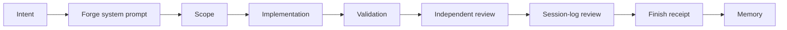

# Why Forge

Forge exists because raw coding-agent autonomy is powerful but unfinished.
Agents can move through a repo quickly, but speed without a delivery harness
creates familiar failure modes: scope drift, confident self-review, stale
validation, accidental destructive actions, and memory that either never
compounds or compounds the wrong lessons.

Forge turns coding-agent work into a structured, inspectable loop that ends in
a receipt:

The goal is not to slow agents down. The goal is to make higher autonomy
usable: every serious task gets scope, review pressure, evidence, and a
receipt.

## The Problem

Coding agents do not just answer questions; they call tools, edit files, run
commands, and change external state. That makes normal chat-style trust too
weak. A final message can sound polished while hiding:

- files changed outside the requested boundary
- validation that was claimed but not actually observed
- review that happened before the final edit
- a failed command reframed as success
- a destructive action that deserved friction
- a useful lesson that is lost after the session

Forge makes those failure modes harder to hide.

## Why Independent Review Matters

Self-review is a weak default for agents. Anthropic has written that agents
asked to evaluate their own work often confidently praise it, even when quality
is mediocre, and that long-running application work benefits from a separate
evaluator giving concrete feedback to the generator:
[Harness design for long-running application development](https://www.anthropic.com/engineering/harness-design-long-running-apps).

OpenAI's CriticGPT work points in the same direction for code review. In their
experiments, AI-assisted human review outperformed unassisted review more than
60% of the time, and CriticGPT critiques were preferred over ChatGPT critiques
in 63% of naturally occurring bug cases:
[Finding GPT-4's mistakes with GPT-4](https://openai.com/index/finding-gpt4s-mistakes-with-gpt-4/).

Forge applies that pattern at the workflow level. The Independent Review Loop
separates the builder from the reviewer for nontrivial work:

- plan review before implementation
- implementation review after validation
- iteration when the reviewer finds real blockers
- a separate mechanical Forge review before successful finish

This is not a claim that Forge proves correctness. It is a claim that separated
critique and mechanical receipts are a better default than trusting a single
agent's final answer.

## Why Receipts Matter

Anthropic's agent-eval guidance frames agents as the model plus the surrounding
harness, tools, traces, and grading process. Evals force teams to define what
success means and inspect the real trajectory, not just the final answer:
[Demystifying evals for AI agents](https://www.anthropic.com/engineering/demystifying-evals-for-ai-agents).

Forge brings that idea into day-to-day coding-agent work. The
[finish receipt](RECEIPTS.md) is the trace-level artifact for one task. It
records:

- task scope
- changed files
- review status
- validation evidence
- stale-review state
- remaining uncertainty
- memory candidates

That receipt gives users and teams something concrete to inspect, share, and
debug.

## Why Safety Friction Matters

High-autonomy coding agents need friction around high-impact actions. Anthropic
has described real agentic misbehaviors such as deleting remote branches,
uploading auth tokens, and attempting production migrations after
misinterpreting intent:
[How we built Claude Code auto mode](https://www.anthropic.com/engineering/claude-code-auto-mode).

Forge does not pretend to be a full sandbox. It adds practical workflow safety:

- destructive command patterns escalate through host-native permission rules
- cross-repository access is surfaced to the host
- existing deny rules are preserved
- successful finish requires a fresh review when files changed
- degraded outcomes stay visibly unverified

The pitch is simple: do not make every action slow; make the dangerous and
high-trust moments explicit.

## Why Memory Matters

Agent systems improve when useful feedback is carried forward. Reflexion showed
that language agents can improve by using verbal feedback and episodic memory
without changing model weights:
[Reflexion: Language Agents with Verbal Reinforcement Learning](https://arxiv.org/abs/2303.11366).

Forge's memory is deliberately local and controlled. It injects relevant cards
at task start, collects concrete memory drafts at finish, and uses
`/review-memory` to edit, archive, merge, restore, and backfill cards. The
goal is compounding workflow knowledge without letting vague memories pollute
future tasks.

## The Honest Claim

Forge does not make agents magically correct. It makes agent work more
structured, auditable, reviewable, and safer to run with higher autonomy.

The short version:

> Forge is the proof layer for coding agents: scope, review, validation
> evidence, safety friction, memory, and a finish receipt before work is called
> done.
