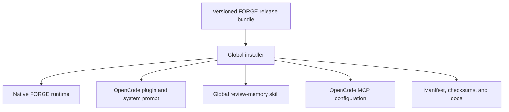

# FORGE Global OpenCode Distribution Requirements

## Summary

FORGE will ship as versioned public release bundles that install globally into OpenCode on Linux, macOS, and Windows. Each bundle will provide the native runtime, OpenCode integration, operating prompt, commands, supported skill, and user-facing documentation without requiring Python or a source checkout.

---

## Problem Frame

The current repository packages the Python runtime and OpenCode assets for source-based installation, but users must install dependencies and register the MCP server and plugin manually. The installation documentation refers to a wheel while `dist/` currently contains no release artifact. The OpenCode plugin also launches its maintenance bridge through a Python module, which prevents a Python-free installation.

The repository still contains package, code, test, prompt, and documentation references to Anvil after its skill was removed. Anvil is not part of FORGE and must not survive into the public distribution or active source tree.

---

## Key Decisions

- **One release bundle per platform target.** GitHub Releases is the public distribution authority for the native runtime and all OpenCode assets.
- **No Python prerequisite.** Users receive a self-contained runtime built for their operating system and architecture.
- **Global OpenCode integration only.** Installation affects the user's OpenCode environment and does not add project-local files.
- **One authoritative package version.** The runtime, plugin, prompts, commands, skills, manifest, and documentation ship together and cannot be upgraded independently.
- **Anvil is absent.** Anvil code, behavior, terminology, tests, packaging entries, prompt references, and documentation are removed rather than deprecated.

---

## Requirements

**Release contents**

- R1. Every published FORGE version must provide a release bundle for each supported Linux, macOS, and Windows target.
- R2. Each release bundle must run without Python, a virtual environment, npm, or access to the source checkout.
- R3. Each release bundle must contain the native FORGE runtime, built OpenCode plugin, system operating prompt, `/review-memory` command behavior, `review-memory` skill, license, manifest, checksums, and installation documentation.
- R4. The release manifest must identify the FORGE version, target operating system, target architecture, included assets, and asset digests.
- R5. The system operating prompt must have one authoritative source and the release build must fail when its generated plugin representation is stale.
- R6. Anvil must be absent from runtime code, public APIs, package data, tests, prompts, skills, and maintained documentation before a release can be produced.

**Installation and OpenCode integration**

- R7. A fresh installation must require one public command on Unix-like systems and one public PowerShell command on Windows.
- R8. Installation must configure FORGE globally for OpenCode without writing into a user's repositories.
- R9. Installation must preserve unrelated global OpenCode settings and support existing JSON and JSONC configuration.
- R10. Configuration changes must be backed up and applied atomically so interruption cannot leave OpenCode with a partial configuration.
- R11. Reinstalling the same FORGE version must be idempotent and must not duplicate plugin, MCP, command, or skill registrations.
- R12. Upgrading FORGE must replace the complete versioned asset set as one unit and must not mix assets from different versions.
- R13. The installed OpenCode plugin must launch the packaged native runtime for both MCP service and maintenance-bridge behavior.
- R14. The installed system prompt must be injected once when the FORGE MCP service is connected.
- R15. The `/review-memory` command must remain plugin-registered and must not require a copied project-local command file.
- R16. The `review-memory` skill must be installed in OpenCode's global skill discovery location.

**Safety and lifecycle**

- R17. The installer must verify downloaded release assets against published cryptographic digests before installation.
- R18. A failed download, verification, extraction, or configuration step must leave the previous working installation usable.
- R19. FORGE must provide a diagnostic command that verifies installed version consistency, executable availability, plugin discovery, skill discovery, global MCP configuration, and runtime startup.
- R20. FORGE must provide an uninstall operation that removes only FORGE-owned files and configuration entries.
- R21. Uninstall must preserve user runtime data by default and offer a separate explicit purge operation.

**Release quality**

- R22. Release automation must build each platform artifact in an environment matching its target operating system.
- R23. Release validation must exercise fresh install, repeat install, upgrade, diagnostics, uninstall, and failure rollback for every supported operating system.
- R24. Release validation must prove that the distributed plugin, prompt, command, skill, and native runtime match the release manifest.
- R25. Publishing must fail if any required asset is missing, any digest is stale, versions disagree, or maintained release content contains Anvil.

The release relationship is:

---

## Key Flows

- F1. Fresh installation
  - **Trigger:** A user runs the documented public installation command with no existing FORGE installation.
  - **Steps:** The installer detects the platform, downloads the matching bundle, verifies it, installs all assets, merges global OpenCode configuration, and runs diagnostics.
  - **Outcome:** Opening OpenCode exposes the FORGE lifecycle tools, system protocol, `/review-memory`, and `review-memory` skill globally.

- F2. Idempotent reinstall or upgrade
  - **Trigger:** A user runs the installer when FORGE is already installed.
  - **Steps:** The installer verifies the requested version, stages the complete replacement, preserves unrelated configuration and runtime data, then atomically activates the requested version.
  - **Outcome:** Exactly one internally consistent FORGE version is active.

- F3. Uninstall
  - **Trigger:** A user invokes the FORGE uninstall operation.
  - **Steps:** The uninstaller removes FORGE-owned binaries, plugin assets, skills, and configuration entries while preserving unrelated OpenCode settings and FORGE runtime data.
  - **Outcome:** OpenCode no longer loads FORGE, and a separate purge remains available for runtime data.

---

## Acceptance Examples

- AE1. **Covers R7-R10, R13-R16.** Given a machine with OpenCode but no FORGE configuration, when the user runs the platform's installation command, then the next OpenCode session loads one FORGE plugin, one FORGE MCP server, the system protocol, `/review-memory`, and the `review-memory` skill.
- AE2. **Covers R9-R10.** Given a commented global OpenCode JSONC configuration with unrelated providers, permissions, plugins, and MCP servers, when FORGE installs, then those values and comments remain intact and the resulting configuration remains valid.
- AE3. **Covers R11-R12.** Given FORGE is installed, when the same version is installed again or a newer version replaces it, then no duplicate registrations exist and all active FORGE assets report one version.
- AE4. **Covers R17-R18.** Given a downloaded bundle whose digest does not match the release manifest, when installation runs, then activation is refused and the prior installation remains usable.
- AE5. **Covers R2, R13.** Given a supported machine without Python or npm, when installation completes and OpenCode invokes FORGE lifecycle and memory-maintenance behavior, then both paths operate through the packaged native runtime.
- AE6. **Covers R19.** Given a missing plugin, stale configuration path, version mismatch, or non-starting runtime, when diagnostics run, then they identify the failing installation component and return a non-success status.
- AE7. **Covers R20-R21.** Given FORGE and unrelated OpenCode configuration are present, when FORGE is uninstalled without purge, then only FORGE integration is removed and runtime data remains.
- AE8. **Covers R6, R25.** Given a release candidate, when release validation scans maintained source and packaged content, then any Anvil implementation, public terminology, test, prompt, skill, package entry, or documentation reference blocks publication.

---

## Scope Boundaries

- Only global OpenCode installation is included; Codex, Claude Code, and other agent hosts are outside scope.
- Project-local OpenCode configuration and per-repository installation are outside scope.
- PyPI and npm are not independent installation channels for the first public distribution.
- Python-based fallback execution is outside scope for installed releases.
- Anvil is outside FORGE's identity and is not retained as an optional or compatibility feature.
- Code signing beyond published cryptographic digests may be added later, but digest verification is required for the first release.

---

## Dependencies and Assumptions

- GitHub Releases can host the platform bundles, installation entry points, manifest, and checksums.
- Release automation has native Linux, macOS, and Windows runners for producing and testing target artifacts.
- OpenCode continues to support global configuration, automatic global plugin loading, and global `SKILL.md` discovery.
- The final platform and architecture matrix will be explicit in the release manifest and installation documentation.

---

## Sources and Research

- Existing package scope and entry point: `pyproject.toml`
- Existing source-install workflow: `INSTALL.md`
- OpenCode plugin and prompt injection: `forge/plugin/opencode/src/index.ts` and `forge/plugin/opencode/src/forge-system.ts`
- Current Python-dependent bridge: `forge/plugin/opencode/src/transport.ts`
- Current command registration: `forge/plugin/opencode/src/maintenance.ts`
- Current supported skill: `forge/skills/review-memory/SKILL.md`
- OpenCode global configuration: https://opencode.ai/docs/config/
- OpenCode global plugins: https://opencode.ai/docs/plugins/
- OpenCode global skills: https://dev.opencode.ai/docs/skills
