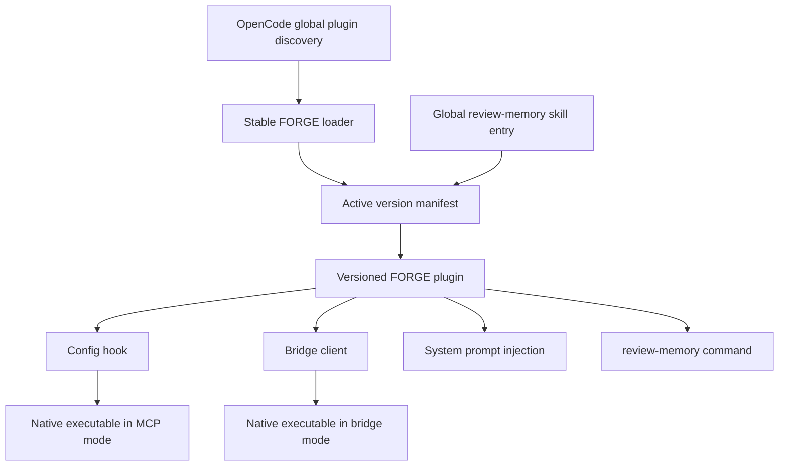
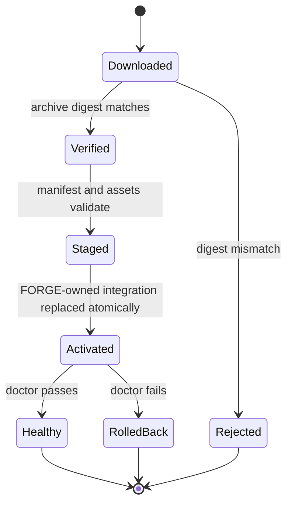

# feat: Ship a global OpenCode distribution

## Summary

Build versioned public FORGE bundles for global OpenCode installation on five native targets. The implementation replaces Python-dependent startup with one frozen runtime, makes the plugin own MCP registration, installs every supported FORGE asset transactionally, and removes Anvil from the product.

---

## Problem Frame

FORGE currently supports source and wheel installation, but users must supply Python, locate the plugin bundle, and register the MCP server manually. The plugin launches its maintenance bridge through `python3 -m`, no public release workflow exists, and `dist/` contains no installable artifact. These constraints prevent a reliable one-command public installation (see origin: `docs/brainstorms/2026-06-22-forge-global-opencode-distribution-requirements.md`).

Anvil was removed as a skill but remains in package metadata, review code, tests, documentation, and generated prompt content. The public distribution must be built only after those remnants are removed.

---

## Requirements

**Release contents**

- R1. Publish bundles for Linux x64, Linux ARM64, macOS x64, macOS ARM64, and Windows x64.
- R2. Installed bundles must run without Python, virtual environments, npm, or the source checkout.
- R3. Each bundle must include the runtime, self-contained OpenCode plugin, system prompt, `/review-memory`, `review-memory` skill, license, manifest, checksums, and installation documentation.
- R4. Each manifest must identify the version, platform, architecture, included assets, and SHA-256 digests.
- R5. The operating prompt must have one source of truth and a stale generated representation must fail validation.
- R6. Anvil must be absent from maintained source, public APIs, package data, tests, prompts, skills, documentation, and release assets.

**Installation and OpenCode integration**

- R7. A fresh installation must use one Unix command or one Windows PowerShell command.
- R8. Installation must configure FORGE globally without writing into repositories.
- R9. Installation must preserve unrelated OpenCode JSON or JSONC configuration.
- R10. Install and upgrade activation must be atomic and retain a recoverable previous version.
- R11. Reinstalling a version must be idempotent with no duplicate registrations.
- R12. Upgrades must activate one complete, internally consistent asset set.
- R13. The plugin must use the packaged runtime for MCP and bridge processes.
- R14. The plugin must inject the system prompt once after the FORGE MCP service connects.
- R15. The plugin must continue registering `/review-memory` without project-local command files.
- R16. Installation must place `review-memory` in OpenCode's global skill discovery directory.

**Safety and lifecycle**

- R17. Bootstrap installers must verify release archives before executing their contents.
- R18. Failed installation stages must leave the prior installation active.
- R19. `doctor` must validate version consistency, asset integrity, plugin and skill discovery, MCP registration, and runtime startup.
- R20. Uninstall must remove only FORGE-owned integration and installation files.
- R21. Uninstall must preserve `~/.forge-alpha/` by default and require an explicit purge to remove runtime data.

**Release quality**

- R22. Native artifacts must be built on matching operating-system runners.
- R23. Every target must validate fresh install, repeat install, upgrade, diagnostics, uninstall, and rollback.
- R24. Release validation must reconcile runtime, plugin, prompt, command, skill, and archive contents with the manifest.
- R25. Publication must fail on missing assets, stale digests, version disagreement, or Anvil remnants.

---

## Key Technical Decisions

- **PyInstaller one-file runtime:** Freeze the Python runtime as one console executable per target using PyInstaller 6.x. PyInstaller requires separate builds on each operating system and supports data collection through a checked-in spec file.
- **One executable, explicit modes:** Route MCP stdio, bridge stdio, install, doctor, version, uninstall, and purge through one CLI entry point. The plugin never needs a Python interpreter or second native binary.
- **Plugin-owned MCP registration:** Extend the existing OpenCode `config` hook to add the local FORGE MCP entry. Installing the plugin globally then configures FORGE without rewriting user JSON or JSONC.
- **Self-contained plugin bundle:** Bundle `@opencode-ai/plugin` and its required runtime dependencies into `dist/index.js` so the global plugin does not require npm or a generated OpenCode `package.json`.
- **Stable global bootstrap assets:** Install a small version-tolerant plugin loader and skill entry point in OpenCode's discovery directories. They resolve the selected version through one FORGE-owned active manifest instead of embedding a version-specific executable path.
- **One atomic activation pointer:** Stage immutable version directories under the platform data root, then replace the active manifest as the single commit point. The manifest selects the runtime, full plugin, and versioned skill content together; the prior version remains available until post-activation diagnostics pass.
- **Verified bootstrap boundary:** Keep the Unix and PowerShell bootstraps small enough to audit. They detect platform, download the archive and checksum file, verify SHA-256, extract to a temporary directory, and delegate durable installation to the verified executable.
- **Five stable release targets:** Ship Linux x64/ARM64, macOS x64/ARM64, and Windows x64. Defer Windows ARM64 until its hosted runner and the complete dependency set are no longer preview risks.
- **OpenCode config-root precedence:** Resolve an explicit installer override first, then `OPENCODE_CONFIG_DIR`, then OpenCode's default global config directory. Keep installable program data separate from `~/.forge-alpha/` runtime data.
- **Checksums before signing:** Publish SHA-256 checksums in the first release to detect corruption and inconsistent downloads. Do not describe checksums as publisher authentication; platform signing and notarization remain follow-up work.
- **Version authority:** Keep the SemVer value in `forge.__version__` authoritative. Build validation must compare normalized Python metadata, plugin metadata, generated assets, manifest values, and tag version before publishing.

---

## High-Level Technical Design

The installed global plugin is the OpenCode entry point. Its config hook registers the native MCP process, its system hook injects the generated operating prompt, and its bridge client launches the same executable in bridge mode.



Installation and upgrades use staging plus a narrow activation point. No partially copied version becomes visible to OpenCode.



---

## Output Structure

```text
.github/
  workflows/
    ci.yml
    release.yml
packaging/
  forge-alpha.spec
scripts/
  build_release.py
  generate_forge_system.py
  install.ps1
  install.sh
forge/
  cli.py
  distribution.py
  plugin/
    opencode/
      loader.js
tests/
  test_cli.py
  test_distribution.py
  test_release_build.py
  test_release_workflow.py
```

Existing plugin, documentation, and test files remain in their current directories.

---

## Implementation Units

### U1. Remove Anvil and enforce source-of-truth invariants

**Goal:** Remove Anvil completely and add build-time checks for product identity, version agreement, and prompt generation.

**Requirements:** R5, R6, R24, R25; covers AE8 in the origin document.

**Dependencies:** None.

**Files:**

- Delete `docs/ANVIL_SKILL.md` and `forge/skills/anvil/SKILL.md`.
- Modify `forge/review/verdict.py`, `tests/test_review_verdict.py`, `tests/test_documentation.py`, `pyproject.toml`, `README.md`, `INSTALL.md`, `docs/FORGE_ALPHA_CONTRACT.md`, `docs/EXTRACTION_LEDGER.md`, `docs/SHIP_READINESS_AUDIT.md`, and `docs/Forge Native Operating.md`.
- Create `scripts/generate_forge_system.py`.
- Regenerate `forge/plugin/opencode/src/forge-system.ts`, `forge/plugin/opencode/dist/index.js`, and `forge/plugin/opencode/dist/index.js.map`.

**Approach:** Preserve deterministic repository review while deleting the unrelated Anvil verdict parser and its tests. Replace manual prompt synchronization with a generator whose check mode compares the canonical markdown prompt to the TypeScript representation. Extend documentation tests to scan maintained and packaged product content for removed Anvil terminology while allowing the historical requirements and plan artifacts that explain its removal.

**Patterns to follow:** Keep `review_repository` and its current focused tests intact. Follow the existing generated-source header and system-prompt marker tests.

**Test scenarios:**

1. Covers AE8. Maintained runtime, plugin, tests, skills, package metadata, and current product documentation contain no Anvil implementation or product terminology.
2. Existing deterministic repository review scenarios still pass after removing the unrelated parser.
3. Editing the canonical operating prompt without regenerating TypeScript makes the prompt check fail.
4. Python, plugin, and distribution version values disagreeing makes release validation fail.

**Verification:** The repository has no active Anvil surface, prompt generation is reproducible, and source/package consistency checks detect deliberate drift.

### U2. Introduce the unified native CLI contract

**Goal:** Provide one executable entry point for MCP, bridge, installation lifecycle, diagnostics, and version reporting.

**Requirements:** R2, R13, R19-R21.

**Dependencies:** U1.

**Files:**

- Create `forge/cli.py` and `tests/test_cli.py`.
- Modify `forge/mcp_server.py`, `forge/plugin/bridge.py`, `forge/__init__.py`, `pyproject.toml`, `tests/test_mcp_contract.py`, and `tests/test_plugin_adapter.py`.

**Approach:** Move process selection into a side-effect-free argument parser. Preserve no-argument MCP startup for current source users while adding explicit MCP and bridge modes for the plugin and frozen runtime. Route installation lifecycle subcommands through the distribution service introduced in U4 without duplicating business rules in the CLI.

**Execution note:** Add CLI dispatch tests before changing the console-script entry point.

**Patterns to follow:** Reuse the existing `main()` functions in `forge/mcp_server.py` and `forge/plugin/bridge.py` as mode handlers. Keep imports side-effect free as required by `forge/__init__.py`.

**Test scenarios:**

1. Invoking the entry point without a subcommand selects MCP stdio for backward compatibility.
2. Explicit MCP and bridge modes dispatch to the correct handler without starting the other protocol.
3. Bridge mode accepts newline-delimited requests and returns one normalized response per request.
4. Version output matches `forge.__version__` and returns success without initializing runtime state.
5. Unknown commands and invalid argument combinations return a non-success status without starting MCP.

**Verification:** Source execution and a frozen smoke executable expose the same CLI contract, and MCP discovery still returns exactly the documented public tools.

### U3. Make the OpenCode plugin self-contained and runtime-aware

**Goal:** Let one globally discovered plugin register and launch the packaged FORGE runtime without npm, Python, or config-file mutation.

**Requirements:** R2, R8-R9, R11, R13-R15.

**Dependencies:** U2.

**Files:**

- Create `forge/plugin/opencode/loader.js`.
- Modify `forge/plugin/opencode/src/index.ts`, `forge/plugin/opencode/src/transport.ts`, `forge/plugin/opencode/src/plugin.ts`, `forge/plugin/opencode/build.mjs`, `forge/plugin/opencode/package.json`, `forge/plugin/opencode/plugin.test.ts`, `forge/plugin/opencode/system-transform.test.ts`, and `tests/test_plugin_adapter.py`.
- Regenerate `forge/plugin/opencode/dist/index.js` and `forge/plugin/opencode/dist/index.js.map`.

**Approach:** Make the global loader resolve and import the versioned plugin selected by the active manifest. Make the global skill entry resolve the versioned skill before maintenance starts. The versioned plugin validates the selected executable before process launch, then adds the FORGE MCP entry through the existing config hook while preserving stricter user-provided disable or deny settings. Bundle plugin runtime dependencies into the distributable JavaScript and retain an explicit environment override for source-development tests only.

**Execution note:** Start with plugin tests for descriptor validation, config idempotence, and bridge command construction.

**Patterns to follow:** Extend `applyForgePermissions` and `installReviewMemoryCommand` rather than creating another config path. Preserve readiness-gated, marker-deduplicated system injection.

**Test scenarios:**

1. Covers AE1. A valid active manifest causes one enabled local `forge-alpha` MCP entry to be added with the native executable command.
2. Reapplying the config hook does not duplicate or weaken an existing FORGE entry.
3. A missing, malformed, version-mismatched, or non-executable active manifest produces an explicit plugin failure without falling back to Python.
4. Bridge requests launch the active manifest's executable in bridge mode and preserve request ordering.
5. The built plugin contains no unresolved `@opencode-ai/plugin` import and loads without an adjacent npm installation.
6. System injection and `/review-memory` registration retain their current behavior.
7. The stable plugin loader and skill entry resolve only paths owned by the active manifest and reject traversal or missing-version targets.

**Verification:** The built JavaScript is a standalone global plugin, config application is idempotent, and both native process paths use the same validated active manifest.

### U4. Implement transactional install, upgrade, doctor, and uninstall

**Goal:** Install versioned FORGE assets globally, activate them atomically, diagnose drift, and remove only FORGE-owned integration.

**Requirements:** R8-R12, R16, R18-R21; covers F1-F3 and AE1-AE3 plus AE6-AE7 in the origin document.

**Dependencies:** U2, U3.

**Files:**

- Create `forge/distribution.py` and `tests/test_distribution.py`.
- Modify `forge/cli.py`, `forge/plugin/protocol.py`, and `tests/test_cli.py`.

**Approach:** Model a bundle manifest and platform-specific install roots in the distribution service. Install version-tolerant global discovery shims, stage and validate the complete immutable version directory, then atomically replace one active manifest that selects the runtime, full plugin, and skill content. Treat that manifest replacement as the commit point and restore its prior contents if diagnostics fail. Record ownership separately so uninstall never infers ownership from broad directories. Keep runtime data outside the installation root and require `purge` for its deletion.

**Execution note:** Implement filesystem behavior against temporary home and config roots before connecting it to the real CLI.

**Patterns to follow:** Follow existing explicit runtime-root injection in `ForgeService` and temporary-directory cleanup patterns in repository review.

**Test scenarios:**

1. Covers F1 / AE1. A fresh bundle install creates one version directory, stable global discovery entries, and one active manifest without modifying a repository or OpenCode config file.
2. Covers AE2. Existing JSON and JSONC files remain byte-for-byte unchanged because MCP registration is plugin-owned.
3. Covers F2 / AE3. Reinstalling the active version is idempotent, while upgrading one active manifest switches runtime, plugin, prompt, command, and skill content together.
4. An invalid manifest, missing asset, digest mismatch, unsafe path, or interrupted staging leaves the prior version active.
5. A failed post-activation doctor restores the previous active manifest and integration assets.
6. Covers AE6. Doctor reports missing assets, digest drift, version mismatch, plugin discovery failure, skill discovery failure, and native bridge/MCP startup failure with a non-success status.
7. Covers F3 / AE7. Uninstall removes only manifest-owned files and preserves unrelated OpenCode files plus `~/.forge-alpha/`.
8. Purge removes runtime data only after explicit selection and never expands outside the resolved runtime root.
9. An explicit config-root override wins over `OPENCODE_CONFIG_DIR`, which wins over the documented OpenCode global default on each platform.

**Verification:** Temporary-home integration tests prove fresh install, repeat install, upgrade, rollback, doctor, uninstall, and purge ownership boundaries.

### U5. Build reproducible release bundles and verified bootstrap installers

**Goal:** Produce deterministic platform archives and one-command bootstrap entry points from a clean checkout.

**Requirements:** R1-R5, R7, R17, R24-R25; covers AE4-AE5 in the origin document.

**Dependencies:** U1-U4.

**Files:**

- Create `packaging/forge-alpha.spec`, `scripts/build_release.py`, `scripts/install.sh`, `scripts/install.ps1`, and `tests/test_release_build.py`.
- Modify `pyproject.toml`, `.gitignore`, and `tests/test_documentation.py`.

**Approach:** Use the PyInstaller spec to freeze only the CLI runtime and required package resources. Build the plugin and canonical prompt first, then assemble an archive containing the executable, plugin, skill, license, installation guide, and manifest. Generate archive checksums after assembly. Render the repository release base into bootstrap assets from an explicit build argument or GitHub's repository context because this checkout has no configured remote.

**Execution note:** First prove a Linux x64 bundle can install and run from a temporary extraction root before generalizing the build metadata for the matrix.

**Patterns to follow:** Keep generated `dist/index.js` committed and validated as the repository already does. Use the package-data test's archive inspection pattern for full bundle validation.

**Test scenarios:**

1. A clean build creates an archive whose manifest lists every required asset with the correct version, platform, architecture, and digest.
2. Covers AE5. The extracted executable starts version, bridge, and MCP modes with Python and npm removed from `PATH`.
3. Unix bootstrap maps supported kernels and architectures to the expected archive and rejects unsupported targets.
4. PowerShell bootstrap maps Windows x64, verifies its checksum, and rejects unsupported architecture.
5. Covers AE4. Both bootstraps refuse a tampered archive before invoking its executable.
6. A stale prompt, unbundled plugin import, missing skill, version mismatch, or Anvil remnant blocks archive creation.
7. Rebuilding from the same source produces identical manifest content apart from explicitly recorded build metadata.

**Verification:** A local Linux bundle passes archive inspection and isolated smoke installation; the same builder contract is ready for native CI runners.

### U6. Add cross-platform CI, release publication, and public documentation

**Goal:** Validate all target bundles on native runners and publish only a complete release with accurate installation guidance.

**Requirements:** R1, R7, R22-R25; covers every origin flow and acceptance example at the release boundary.

**Dependencies:** U5.

**Files:**

- Create `.github/workflows/ci.yml`, `.github/workflows/release.yml`, and `tests/test_release_workflow.py`.
- Modify `README.md`, `INSTALL.md`, `docs/INSTALL.md`, `docs/TROUBLESHOOTING.md`, `docs/WALKTHROUGH.md`, `docs/SHIP_READINESS_AUDIT.md`, and `tests/test_documentation.py`.

**Approach:** Run Python and plugin tests on ordinary changes. On version tags, build the five native targets, run each bundle's isolated install lifecycle, upload intermediate artifacts, and use a final job to verify the complete matrix and publish release assets plus checksums. Publish only after every target passes. Document stable one-line Unix and PowerShell entry points, supported targets, data-preservation behavior, diagnostics, uninstall, and the current no-signing limitation.

**Patterns to follow:** Use GitHub-hosted native runners and Git-tag-backed releases. Prefer official GitHub artifact actions and GitHub CLI/API release creation over third-party publishing actions.

**Test scenarios:**

1. Pull-request CI detects Python, TypeScript, generated-prompt, documentation-link, version, and forbidden-content failures.
2. Each matrix runner builds a target-matching executable and completes fresh install, repeat install, doctor, and uninstall in an isolated home.
3. The release aggregation job refuses publication when any target, manifest, checksum, installer asset, or required document is absent.
4. A tag that does not match the authoritative package version is rejected.
5. Published documentation names exactly the supported targets and does not claim code signing or Windows ARM64 support.

**Verification:** The workflow definition enforces a complete five-target release, and the documentation tests keep public commands and shipped behavior synchronized.

---

## System-Wide Impact

- **OpenCode startup:** Global plugin discovery becomes the sole configuration entry point. The plugin adds MCP, permission, command, and prompt behavior in one hook path.
- **Process model:** MCP and bridge become modes of one executable, while persistent task, telemetry, and memory data stay under the existing runtime root.
- **Contributor workflow:** Prompt, plugin, version, and release assets gain generated-file checks that must pass before publication.
- **Public distribution:** GitHub tags and release manifests become externally consumed contracts. Their names and asset matrix must remain stable within a release line.
- **Existing source users:** The no-argument MCP entry remains compatible, but installation documentation moves to the native bundle as the primary path.

---

## Risks and Mitigations

| Risk | Mitigation |
|---|---|
| PyInstaller misses dynamic MCP or package-resource imports | Maintain a checked-in spec and smoke MCP, bridge, skill loading, and `doctor` from every frozen target. |
| Bundled plugin dependencies conflict with OpenCode runtime assumptions | Test the final standalone bundle through OpenCode's plugin contract and reject unresolved package imports. |
| Windows holds active executables or plugin files open during upgrade | Stage immutable versions, require OpenCode shutdown when replacement is blocked, and retain rollback metadata. |
| Global plugin config hook ordering does not start the new MCP on the first session | Add an actual OpenCode startup smoke test where available and make `doctor` distinguish discovery from connection. |
| Antivirus products flag unsigned one-file executables | Publish checksums, document the unsigned preview status, and keep code signing as the next distribution hardening step. |
| Users mistake checksums for proof of publisher identity | State that SHA-256 detects corruption only; do not claim authenticity until signing is implemented. |
| A mutable latest installer downloads an inconsistent release | Resolve one release version first, then fetch the archive and checksum from that same version. |
| Versioned assets accumulate indefinitely | Remove superseded versions only after healthy activation while retaining one rollback version. |
| No Git remote is configured in this checkout | Derive public repository coordinates from the release workflow and require an explicit repository argument for local installer builds. |

---

## Scope Boundaries

### Included

- Global OpenCode installation and lifecycle on the five confirmed targets.
- Native runtime packaging, plugin-owned MCP registration, prompt and command delivery, `review-memory` skill delivery, checksums, CI, and public documentation.
- Complete removal of Anvil from the maintained product and release artifacts.

### Outside this release

- Codex, Claude Code, and other host adapters.
- Project-local installation or repository mutation.
- PyPI or npm as independent public installation channels.
- Windows ARM64, Linux distributions outside the chosen runner compatibility baseline, and 32-bit platforms.
- Platform code signing, macOS notarization, package-manager formulas, and automatic background updates.

### Deferred to Follow-Up Work

- Signed and notarized platform artifacts after release identity and certificates are available.
- Windows ARM64 once the runner and dependency matrix are stable enough for the same release gates.
- Homebrew, WinGet, Scoop, or similar package-manager publication after the direct installer contract stabilizes.

---

## Documentation and Operational Notes

- Public docs must lead with the one-line installer for the user's platform, then state supported targets and how to pin a version.
- Troubleshooting must distinguish bootstrap verification failures, installation rollback, plugin discovery, MCP connection, and runtime-data problems.
- Release notes must state that first-release binaries are checksum-verified but unsigned.
- The release workflow needs `contents: write` only in the final publication job; build and test jobs remain read-only.
- Runtime data remains at `~/.forge-alpha/` unless the user has set `FORGE_ALPHA_HOME`.

---

## Sources and Research

- Origin requirements: `docs/brainstorms/2026-06-22-forge-global-opencode-distribution-requirements.md`
- Existing packaging contract: `pyproject.toml`, `INSTALL.md`, and `tests/test_documentation.py`
- Existing plugin lifecycle: `forge/plugin/opencode/src/index.ts`, `forge/plugin/opencode/src/transport.ts`, and `forge/plugin/opencode/src/maintenance.ts`
- Existing runtime protocols: `forge/mcp_server.py`, `forge/plugin/bridge.py`, and `forge/plugin/protocol.py`
- OpenCode global config and JSONC support: https://opencode.ai/docs/config/
- OpenCode global plugin discovery: https://opencode.ai/docs/plugins/
- OpenCode global skills: https://dev.opencode.ai/docs/skills
- OpenCode local MCP command contract: https://opencode.ai/docs/mcp-servers/
- PyInstaller native-per-OS and one-file behavior: https://pyinstaller.org/en/stable/usage.html
- PyInstaller data and spec-file behavior: https://pyinstaller.org/en/latest/spec-files.html
- GitHub-hosted runner matrix: https://docs.github.com/en/actions/reference/runners/github-hosted-runners
- GitHub release asset model: https://docs.github.com/en/repositories/releasing-projects-on-github/about-releases
